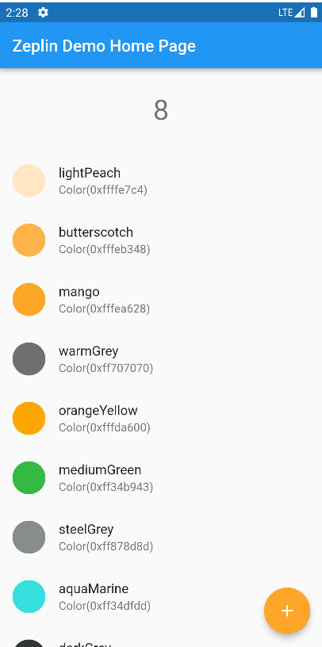
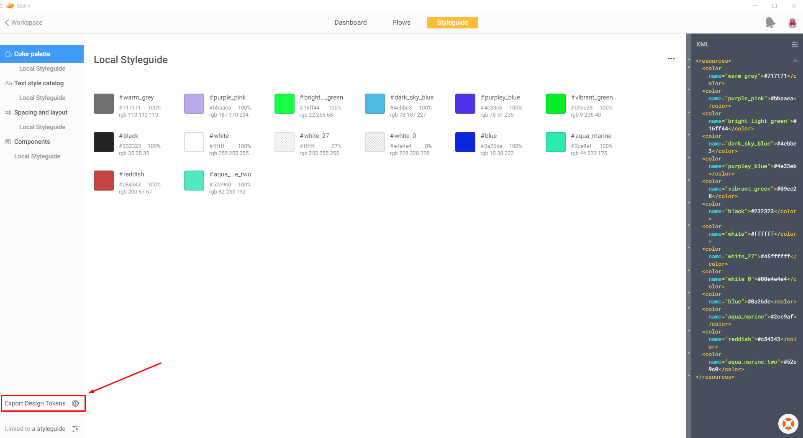
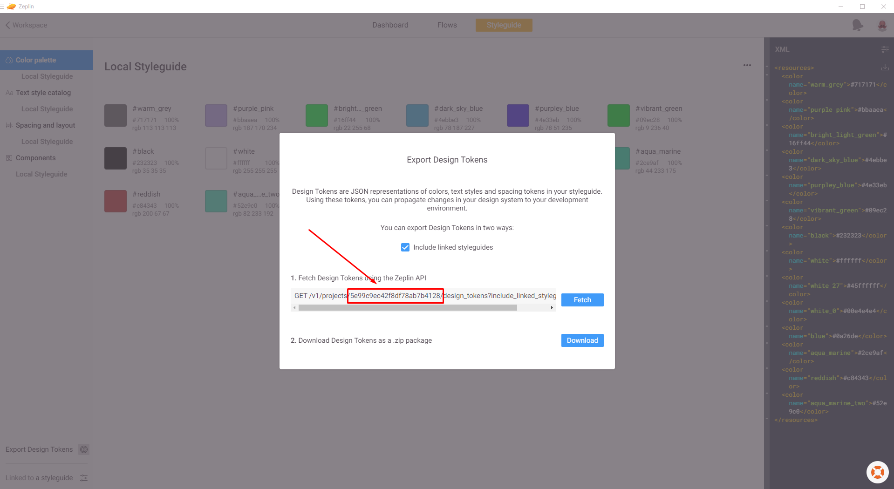
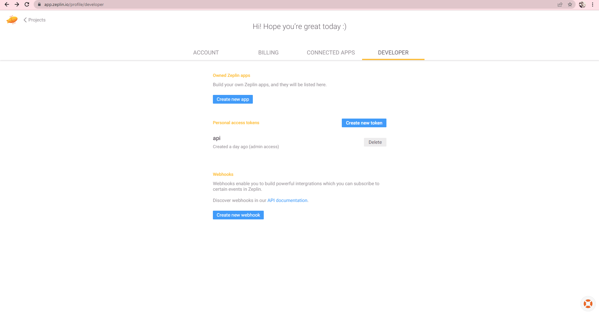
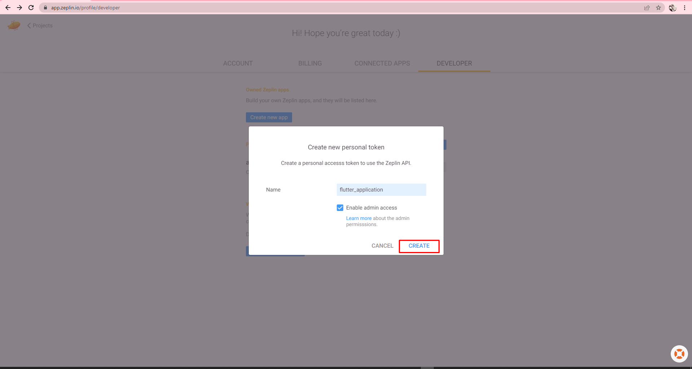
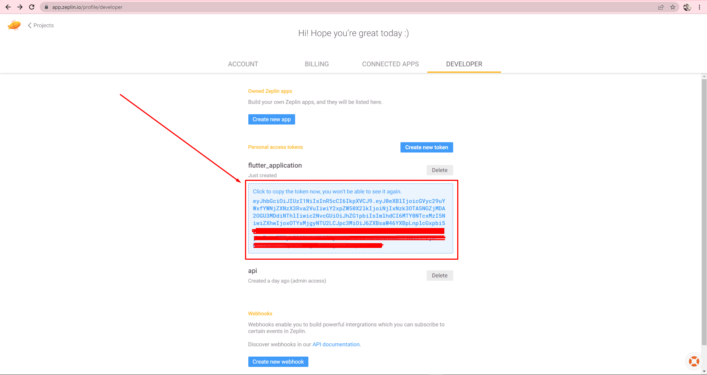

# Zeplin_Flutter

Control your flutter application on [zeplin](https://zeplin.io).

## Usage

```dart
var zeplinData = ZeplinFlutter.fetchFromZeplin(token: @token,projectId: @projectId);
zeplinData.getColor(@COLORNAME); //Color
zeplinData.getTextStyle(@STYLENAME); //TextStyle
zeplinData.boxSpace(@SPACERNAME); //SizedBox
zeplinData.horizontalSpace(@SPACERNAME); //SizedBox
zeplinData.verticalSpace(@SPACERNAME); //SizedBox

--- OR ---

await ZeplinFlutter.fetchFromZeplin(token: @token,projectId: @projectId);

ZeplinFlutter.instance.getColor(@COLORNAME); //Color
ZeplinFlutter.instance.getTextStyle(@STYLENAME); //TextStyle
ZeplinFlutter.instance.boxSpace(@SPACERNAME); //SizedBox
ZeplinFlutter.instance.horizontalSpace(@SPACERNAME); //SizedBox
ZeplinFlutter.instance.verticalSpace(@SPACERNAME); //SizedBox
```

## Example




## How To Get Project ID

open your project on [zeplin app](https://support.zeplin.io/en/articles/244698-downloading-mac-and-windows-apps) or [web site](https://app.zeplin.io) then go to styleguide tab

Step 1             |  Step2
:-------------------------:|:-------------------------:
 | 


## How To Get Token

go to zeplin [developer page](https://app.zeplin.io/profile/developer) 

Step 1             |  Step 3             | Step 3
:-------------------------:|:-------------------------:|:-------------------------:
 |  | "# Zeplin_Flutter" 
